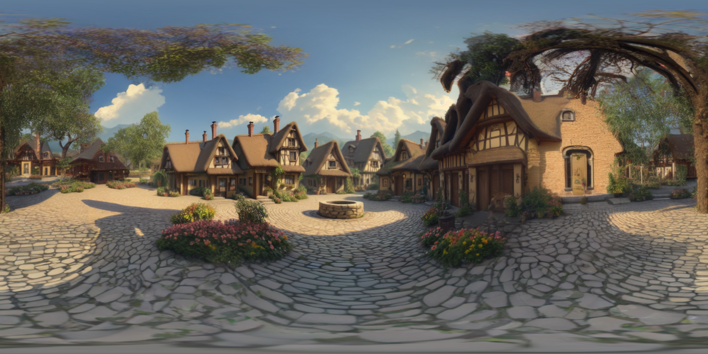
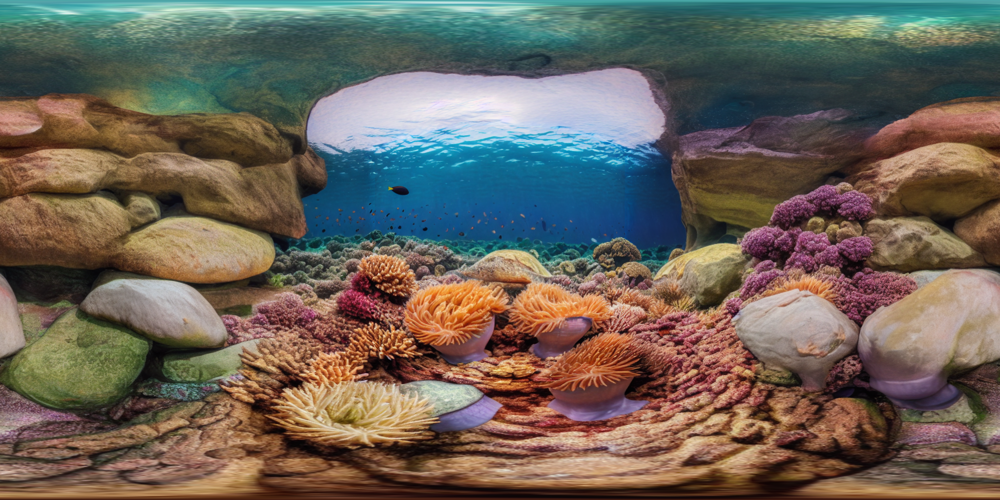

# Singularity3D: World Synthesis with Spherical SfM and Feature 3DGS

</div>

<div align="justify">

Singularity3D synthesizes a full 3D world from a single image by combining a generative panorama prior, an orbit-conditioned spherical SfM trajectory, and semantic 3D Gaussian scene reconstruction. The system expands a single view into a geometrically anchored, semantically structured 3D representation using spherical multi-view hallucination and feature-driven Gaussian splatting.

</div>

<p align="center">
  
</p>

## 🖥️ Tested Configuration
Singularity3D has been tested on:

- 🐧 **Ubuntu:** 24.04  
- 🧠 **GPU:** NVIDIA RTX A6000  
- ⚙️ **CUDA:** 13.0  
- 🧊 **Environment:** Docker container with GPU support

> Other modern Ubuntu + CUDA setups may work, but this is the validated reference configuration.

> A GPU with ≥ 24 GB of VRAM is recommended to ensure efficient handling of high-resolution inputs across all components.

## 🚀 Quick Start

1. Clone the repo

```shell
git clone https://github.com/jagennath-hari/Singularity3D.git && cd Singularity3D
```

2. Download [SAM ViT](https://segment-anything.com/) weights

```shell
bash download_sam.sh
```

3. Run the demo inside Docker
```shell
bash scripts/build_and_start.sh
bash singularity.sh /data/example5.png
```

> Change input images by providing path from `/data` folder

## 🔭 Visualizing the 3D Gaussian Scene

Use the provided viewer script to visualize the generated Gaussian scene:

```bash
bash view.sh /data/output/<basename>
```

## 📸 Pipeline Outputs

### Village 

<table>
  <!-- Header row -->
  <tr>
    <td align="center" width="400" height="30"><b>Input Image</b></td>
    <td align="center" width="400" height="30"><b>Generated Panorama</b></td>
  </tr>

  <!-- Input + Panorama images -->
  <tr>
    <td width="400" height="300">
      
    </td>
    <td width="400" height="300">
      
    </td>
  </tr>

  <!-- 3DGS label -->
  <tr>
    <td colspan="2" align="center" width="800" height="30"><b>Feature 3DGS Reconstruction</b></td>
  </tr>

  <!-- 3DGS GIF -->
  <tr>
    <td colspan="2" width="800" height="500">
      
    </td>
  </tr>
</table>

### Coralreef

<table>
  <!-- Header row -->
  <tr>
    <td align="center" width="400" height="30"><b>Input Image</b></td>
    <td align="center" width="400" height="30"><b>Generated Panorama</b></td>
  </tr>

  <!-- Input + Panorama images -->
  <tr>
    <td width="400" height="300">
      
    </td>
    <td width="400" height="300">
      
    </td>
  </tr>

  <!-- 3DGS label -->
  <tr>
    <td colspan="2" align="center" width="800" height="30"><b>Feature 3DGS Reconstruction</b></td>
  </tr>

  <!-- 3DGS GIF -->
  <tr>
    <td colspan="2" width="800" height="500">
      
    </td>
  </tr>
</table>

## 📖 Citation
If you found this code/work to be useful in your own research, please considering citing the following:

```bibtex
@misc{kalischek2025cubediffrepurposingdiffusionbasedimage,
      title={CubeDiff: Repurposing Diffusion-Based Image Models for Panorama Generation}, 
      author={Nikolai Kalischek and Michael Oechsle and Fabian Manhardt and Philipp Henzler and Konrad Schindler and Federico Tombari},
      year={2025},
      eprint={2501.17162},
      archivePrefix={arXiv},
      primaryClass={cs.CV},
      url={https://arxiv.org/abs/2501.17162}, 
}
```

```bibtex
@inproceedings{Ventura_2025_ICCV,
    author    = {Ventura, Jonathan and Larsson, Viktor and Kahl, Fredrik},
    title     = {Uncalibrated Structure from Motion on a Sphere},
    booktitle = {Proceedings of the IEEE/CVF International Conference on Computer Vision (ICCV)},
    month     = {October},
    year      = {2025},
    pages     = {69-78}
}
```

```bibtex
@article{kirillov2023segany,
  title={Segment Anything},
  author={Kirillov, Alexander and Mintun, Eric and Ravi, Nikhila and Mao, Hanzi and Rolland, Chloe and Gustafson, Laura and Xiao, Tete and Whitehead, Spencer and Berg, Alexander C. and Lo, Wan-Yen and Doll{\'a}r, Piotr and Girshick, Ross},
  journal={arXiv:2304.02643},
  year={2023}
}
```

```bibtex
@inproceedings{zhou2024feature,
    title={Feature 3dgs: Supercharging 3d gaussian splatting to enable distilled feature fields},
    author={Zhou, Shijie and Chang, Haoran and Jiang, Sicheng and Fan, Zhiwen and Zhu, Zehao and Xu, Dejia and Chari, Pradyumna and You, Suya and Wang, Zhangyang and Kadambi, Achuta},
    booktitle={Proceedings of the IEEE/CVF Conference on Computer Vision and Pattern Recognition},
    pages={21676--21685},
    year={2024}
}
```

## 📄 License
This project is released under the [BSD 3-Clause License](LICENSE).

You may use, modify, and distribute this software freely, including in
proprietary and commercial applications, as long as you retain the original
copyright notice and do not use the project authors’ names for endorsement.


## 🙏 Acknowledgement
This work integrates several powerful research papers, libraries, and open-source tools:

- [**CubeDiff**](https://cubediff.github.io/)
- [**Spherical SfM**](https://jonathanventura.github.io/spherical-sfm/pages/iccv2025/)
- [**Segment Anything**](https://segment-anything.com/)
- [**Feature 3DGS**](https://feature-3dgs.github.io/) 